# 📊 Multi-Domain Data Analysis Portfolio (5 Real-World Projects)


[](https://github.com/<your-username>/Multi-Domain-Data-Analysis-Portfolio/releases/tag/v1.0.0)


## 📌 Overview

This repository contains a **professional multi-domain data analysis portfolio** comprising **five end-to-end analytics projects** across **Retail, Education, Weather, Healthcare, and Finance** domains.

Each project demonstrates:

* Real-world data cleaning and validation
* Exploratory and advanced data analysis
* Insightful visualizations (PNG exports)
* CLI dashboards for quick insights
* Professional PDF reports with executive summaries
* Modular, reusable, OS-independent Python code

This portfolio is designed to showcase **industry-ready data analysis skills** suitable for academic evaluation, internships, and full-time analytics roles.

---

## 🧠 Domains Covered

| Project   | Domain               | Focus Area                               |
|-----------|----------------------|------------------------------------------|
| Project 1 | Retail Analytics     | Supermarket sales & customer behavior    |
| Project 2 | Education Analytics  | Student performance & academic trends    |
| Project 3 | Weather Analytics    | Climate trends & meteorological patterns |
| Project 4 | Healthcare Analytics | COVID-19 clinical risk & outcomes        |
| Project 5 | Finance Analytics    | Investor behavior & market preferences   |

---

## 🛒 Project 1 – Retail Analytics (Supermarket Sales)

### 📌 Problem Statement

Retail businesses generate large volumes of transactional data, but extracting insights related to sales trends, customer behavior, and product performance is critical for improving revenue and operational efficiency.

### 🎯 Objectives

* Analyze daily, monthly, and hourly sales trends
* Identify top-performing product categories
* Understand customer purchase behavior
* Detect revenue and quantity mismatches

### 🛠️ Key Techniques Used

* Time-series aggregation
* Customer-level analysis
* Category-wise revenue analysis
* Correlation analysis between quantity and sales

### 📊 Sample Visualizations

| Daily Sales Trend                                     | Monthly Sales                                           | Payment method share                                     |
|-------------------------------------------------------|---------------------------------------------------------|----------------------------------------------------------|
| 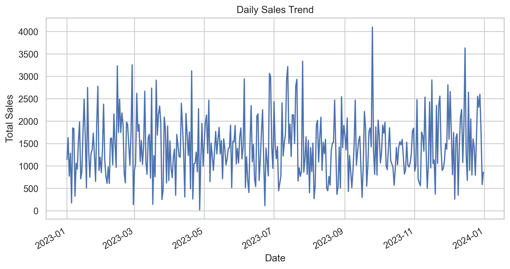 | 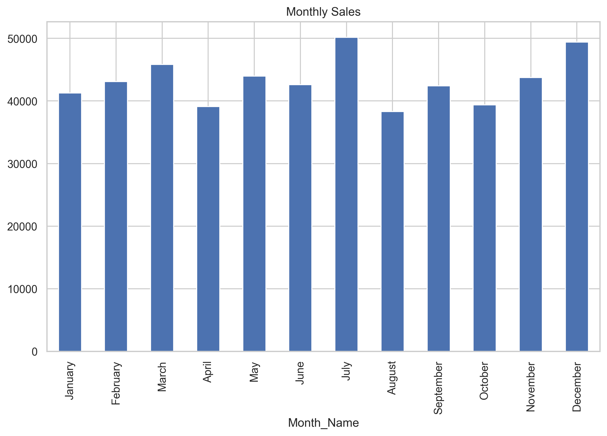 | 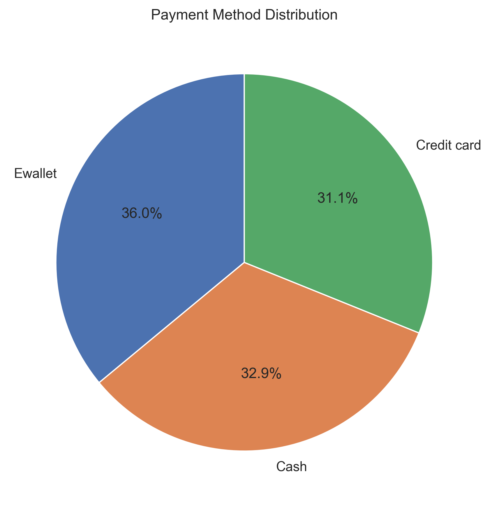 |

📄 **PDF Report:**  
[Supermarket Sales Analysis Report](docs/01_supermarket_sales.pdf)

### 📄 Outputs

* CLI-based sales summary dashboard
* Professional PDF report with business insights
* PNG visualizations for reporting

---

## 🎓 Project 2 – Education Analytics (Student Performance)

### 📌 Problem Statement

Educational institutions need data-driven insights to understand academic performance, attendance impact, and subject-wise strengths and weaknesses.

### 🎯 Objectives

* Analyze student pass/fail trends
* Study subject-wise performance
* Examine attendance vs academic score correlation
* Identify demographic performance patterns

### 🛠️ Key Techniques Used

* Descriptive statistics (mean, median)
* Correlation analysis
* Group-wise performance aggregation
* Academic outcome classification

### 📊 Sample Visualizations

| Pass/Fail Distribution                                             | Attendance vs Score                                             | correlation_heatmap                                             |
|--------------------------------------------------------------------|-----------------------------------------------------------------|-----------------------------------------------------------------|
| 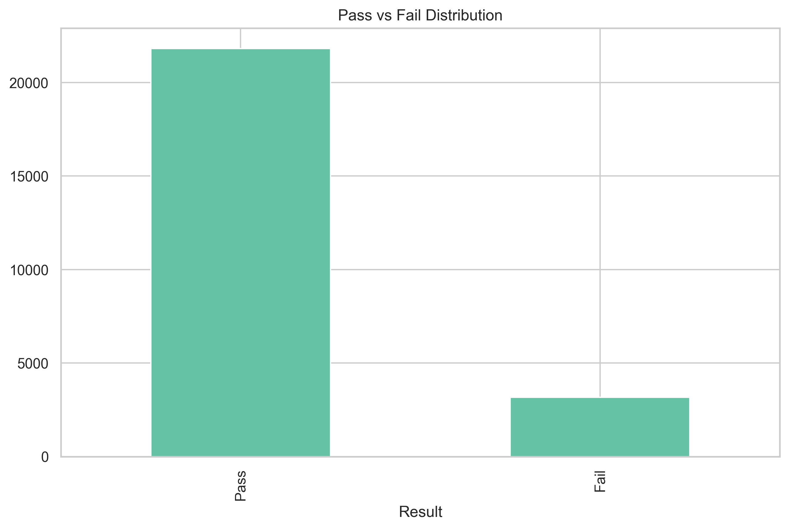 | 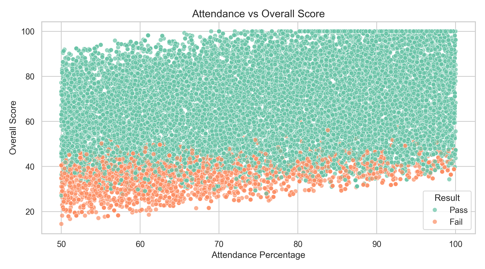 | 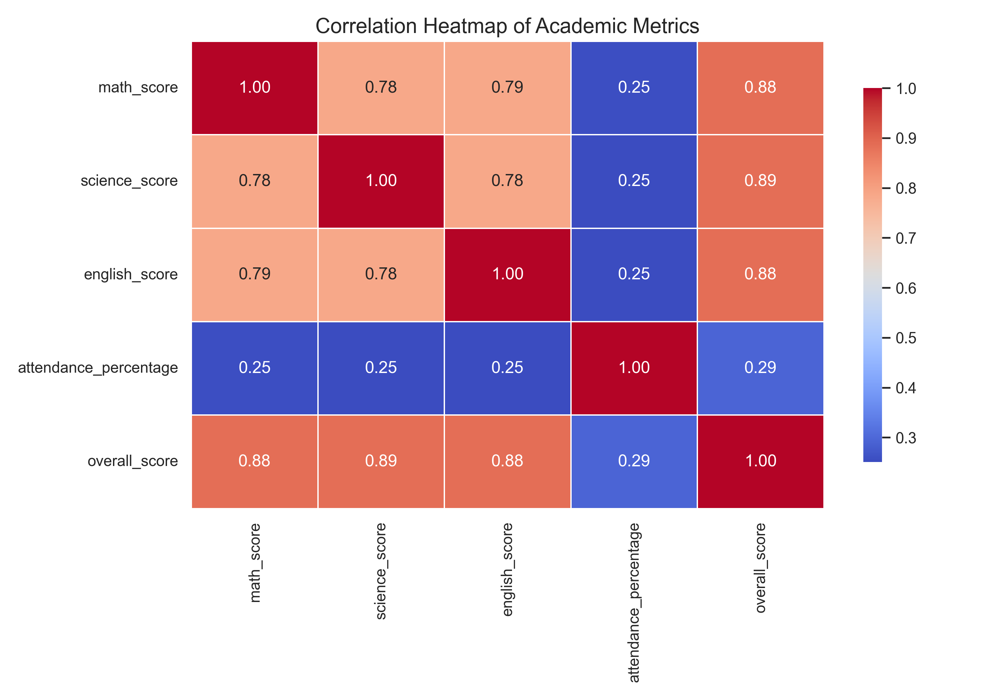 |

📄 **PDF Report:**  
[Student Performance Analysis Report](docs/02_student_performance.pdf)

### 📄 Outputs

* Student performance CLI dashboard
* Academic insights PDF report
* Exported PNG charts for evaluation

---

## 🌦️ Project 3 – Weather Analytics (Climate Trends)

### 📌 Problem Statement

Raw weather data alone does not reveal climate trends or seasonal behavior. Structured analysis is required to understand long-term temperature changes and meteorological relationships.

### 🎯 Objectives

* Identify temperature trends over time
* Analyze seasonal and monthly patterns
* Study relationships between temperature, humidity, and wind
* Detect climate variability

### 🛠️ Key Techniques Used

* Time-series analysis
* Seasonal aggregation
* Correlation heatmaps
* Climate pattern visualization

### 📊 Sample Visualizations

| Temperature Trend                                 | Monthly Avg Temperature                                     | Correlation Heatmap                                 |
|---------------------------------------------------|-------------------------------------------------------------|-----------------------------------------------------|
| 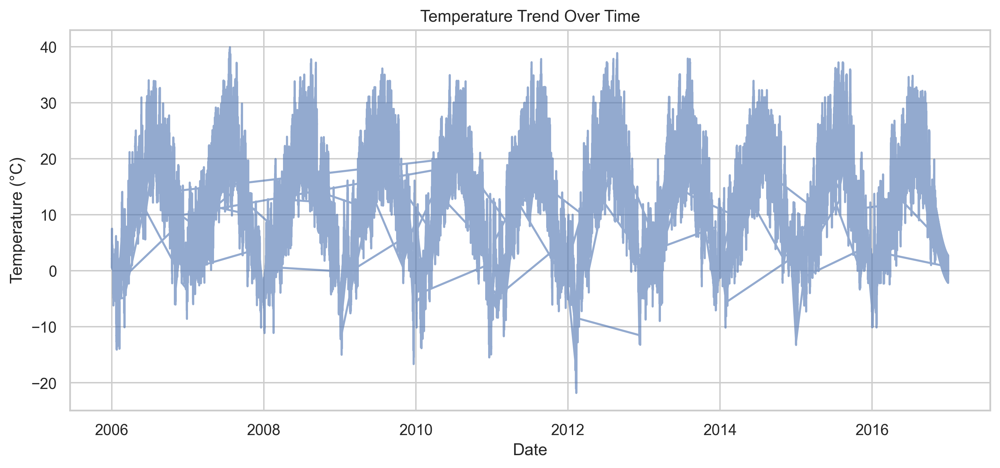 | 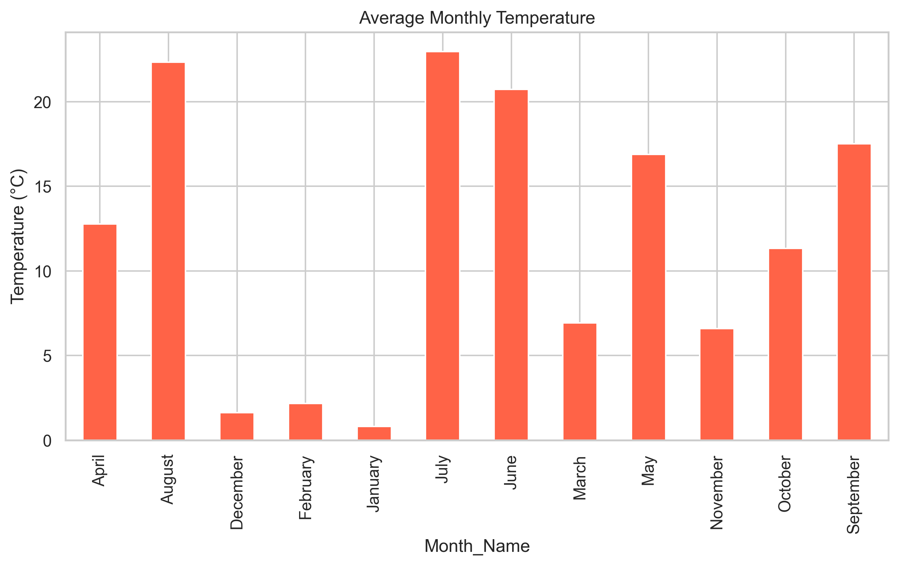 | 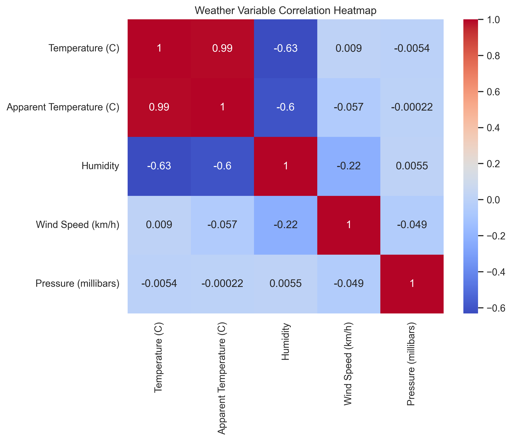 |

📄 **PDF Report:**  
[Weather Trends Analysis Report](docs/03_weather_analysis.pdf)

### 📄 Outputs

* Weather trends CLI dashboard
* Climate analysis PDF report
* Publication-quality PNG visualizations

---

## 🏥 Project 4 – Healthcare Analytics (COVID-19)

### 📌 Problem Statement

Healthcare systems require data-driven insights to identify high-risk COVID-19 patients, understand mortality patterns, and allocate critical resources effectively.

### 🎯 Objectives

* Analyze COVID mortality patterns
* Study age-based risk distribution
* Evaluate impact of comorbidities
* Assess ICU admission outcomes

### 🛠️ Key Techniques Used

* Clinical feature engineering
* Risk stratification
* Mortality rate computation
* Healthcare correlation analysis

### 📊 Sample Visualizations

| Mortality Distribution                                    | Age Group Mortality                                    | Clinical Correlation                                            |
|-----------------------------------------------------------|--------------------------------------------------------|-----------------------------------------------------------------|
| 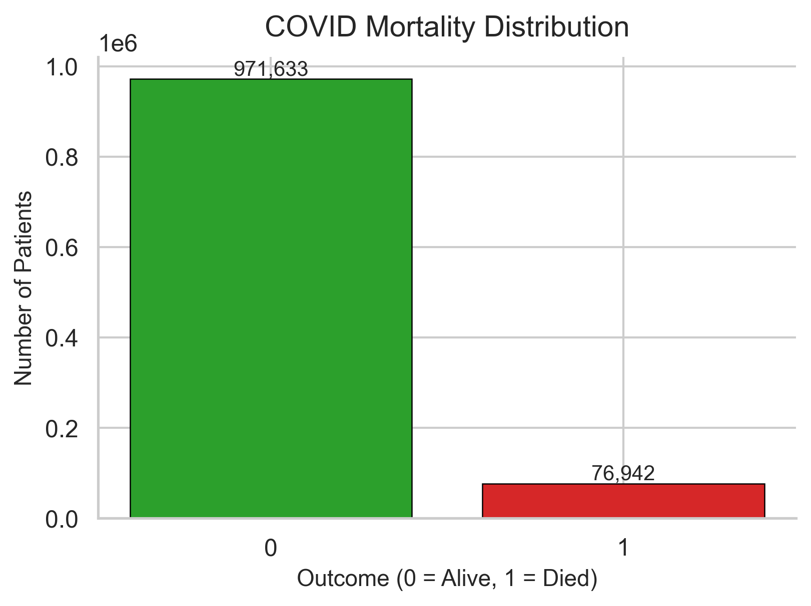 | 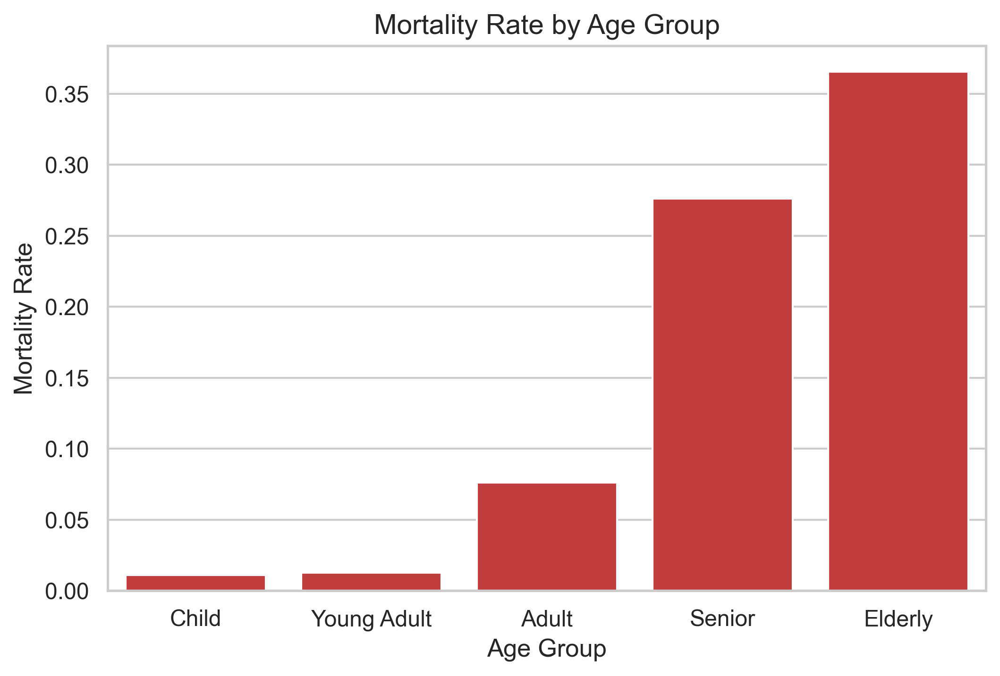 | 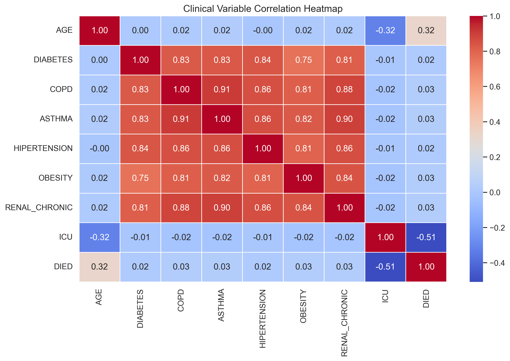 |

📄 **PDF Report:**  
[Healthcare COVID Analysis Report](docs/04_healthcare_covid.pdf)

### 📄 Outputs

* Healthcare CLI dashboard
* Clinical insights PDF report
* Professional healthcare-grade visualizations

---

## 💰 Project 5 – Finance & Stock Market Analytics

### 📌 Problem Statement

Investor behavior varies widely based on demographics, risk appetite, and financial objectives. Understanding these patterns is essential for financial advisory and product design.

### 🎯 Objectives

* Analyze preferred investment avenues
* Study equity market participation
* Examine risk tolerance and monitoring behavior
* Identify correlations among investment instruments

### 🛠️ Key Techniques Used

* Behavioral finance analysis
* Demographic segmentation
* Risk vs investment mapping
* Correlation clustering

### 📊 Sample Visualizations

| Preferred Avenues                                            | Risk vs Avenue                                        | Instrument Correlation                                        |
|--------------------------------------------------------------|-------------------------------------------------------|---------------------------------------------------------------|
| 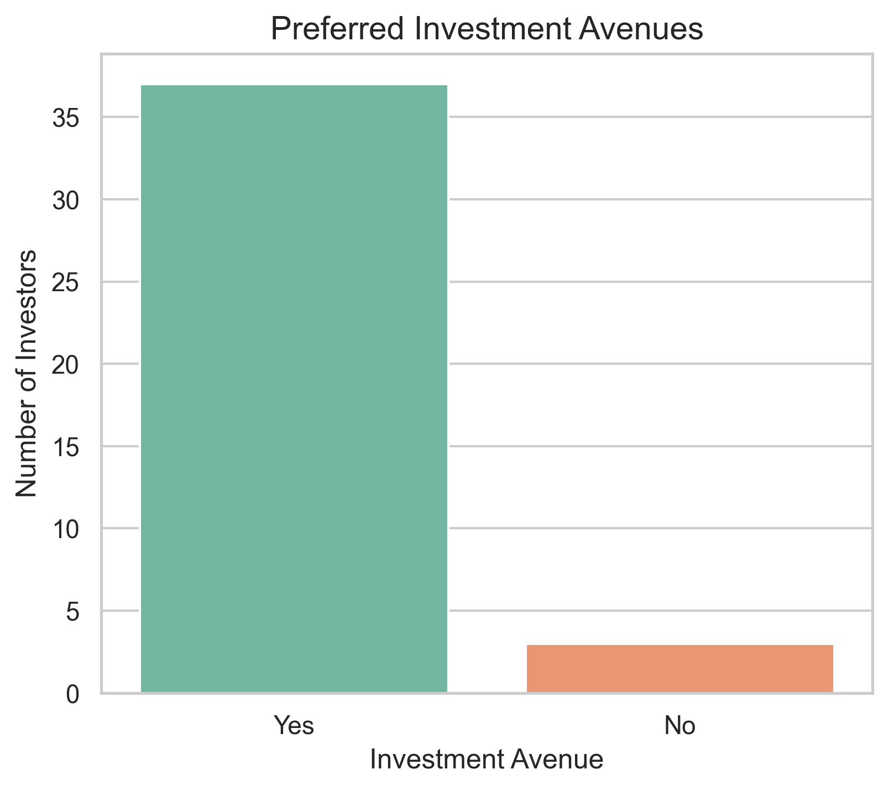 |  | 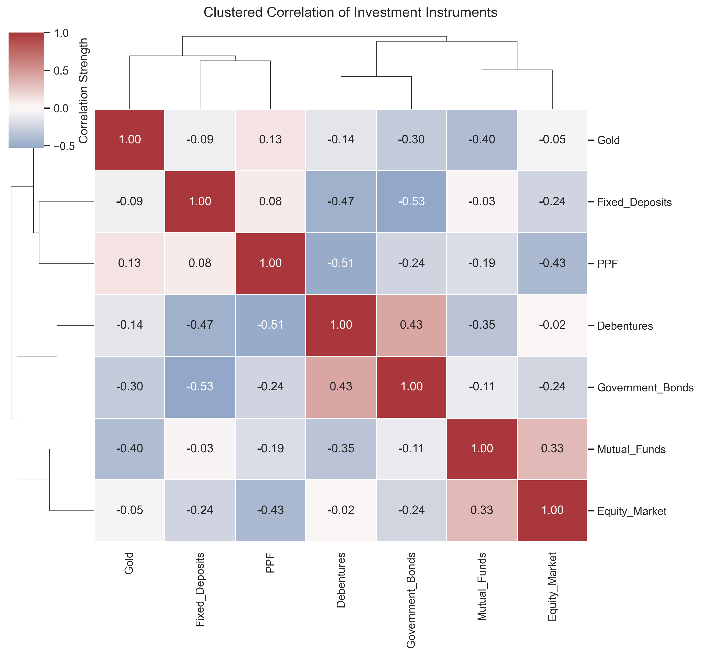 |

📄 **PDF Report:**  
[Finance Stock Market Analysis Report](docs/05_finance_analysis.pdf)

### 📄 Outputs

* Advanced finance CLI dashboard
* Investor behavior PDF report
* 10+ professional finance visualizations

## 🛠️ Tech Stack & Tools

* **Programming Language:** Python
* **Data Analysis:** Pandas, NumPy
* **Visualization:** Matplotlib, Seaborn
* **Notebooks:** Jupyter Notebook
* **CLI Dashboards:** Python (`argparse`)
* **Reports:** Markdown → PDF
* **Architecture:** Modular Python packages
* **OS Compatibility:** Windows, macOS, Linux

---

## 📁 Final Project Structure

```
Multi-Domain-Data-Analysis-Portfolio/
│
├── datasets/                       # Raw datasets (CSV)
│   ├── supermarket_sales.csv
│   ├── Student_Performance.csv
│   ├── weatherHistory.csv
│   ├── Covid Data.csv
│   └── Finance_data.csv
│
├── dashboards/                 # CLI dashboards for all domains
│   ├── supermarket_dashboard.py
│   ├── student_dashboard.py
│   ├── weather_dashboard.py
│   ├── healthcare_dashboard.py
│   └── finance_dashboard.py
│
├── notebooks/                      # Jupyter notebooks (analysis)
│   ├── 01_supermarket_sales.ipynb
│   ├── 02_student_performance.ipynb
│   ├── 03_weather_trends_analysis.ipynb
│   ├── 04_healthcare_covid_analysis.ipynb
│   └── 05_finance_stock_market_analysis.ipynb
│
├── src/                            # Modular source code
│   ├── supermarket_sales_analysis/
│   ├── student_performance_analysis/
│   ├── weather_trends_analysis/
│   ├── healthcare_covid_analysis/
│   └── finance_stock_market_analysis/

│
├── visualizations/                 # Exported PNG charts
│   ├── supermarket/
│   ├── student/
│   ├── weather/
│   ├── healthcare/
│   └── finance/
│
├── docs/                        # Professional PDF reports
│   ├── Supermarket_Sales_Report.pdf
│   ├── Student_Performance_Report.pdf
│   ├── Weather_Trends_Report.pdf
│   ├── Healthcare_COVID_Report.pdf
│   └── Finance_Stock_Market_Report.pdf
│
├── reports/                           # HTML exports
│
├── requirements.txt                # Python dependencies
└── README.md                       # Portfolio overview (this file)
```

---

## 🚀 How to Set Up & Run the Projects

### 1️⃣ Clone the Repository

```bash
git clone https://github.com/<your-username>/Multi-Domain-Data-Analysis-Portfolio.git
cd Multi-Domain-Data-Analysis-Portfolio
```

---

### 2️⃣ Create Virtual Environment (Recommended)

```bash
python -m venv .venv
```

Activate:

* **Windows**

```bash
.venv\Scripts\activate
```

* **macOS / Linux**

```bash
source .venv/bin/activate
```

---

### 3️⃣ Install Dependencies

```bash
pip install -r requirements.txt
```

---

## 📊 Running the CLI Dashboards

Each project includes a **CLI dashboard** for quick insights.

### ▶ Supermarket Sales

```bash
python dashboards/supermarket_dashboard.py
```

### ▶ Student Performance

```bash
python dashboards/student_dashboard.py
```

### ▶ Weather Trends

```bash
python dashboards/weather_dashboard.py
```

### ▶ Healthcare (COVID)

```bash
python dashboards/healthcare_dashboard.py
```

### ▶ Finance / Stock Market

```bash
python dashboards/finance_dashboard.py
```

📌 All dashboards accept `--data` arguments if custom paths are needed.

---

## 📈 Visualizations 

* All charts are **exported as PNG** under `visualizations/`
* Generated using **Seaborn & Matplotlib**
* Designed to be **PDF-ready and publication-quality**
* Color-friendly and case-safe with CSV columns

---

## 📄 PDF Reports

Each project includes a **professional PDF report** featuring:

* Executive summary
* Business / domain problem statement
* Methodology
* Key visualizations
* Statistical findings
* Actionable insights & recommendations

📁 Located in the `reports/` directory.

---

## 🧪 Quality & Validation Standards

✔ CSV column case-safety enforced
✔ OS-independent path handling (`pathlib`)
✔ No hard-coded file paths
✔ Modular, reusable code
✔ Notebook ↔ CLI ↔ PDF consistency
✔ Clear separation of logic and visualization

---

## 🎯 What This Portfolio Demonstrates

* Multi-domain analytical thinking
* End-to-end project lifecycle (EDA → CLI → PDF) with Strong EDA and visualization skills
* Clean Python architecture
* Business and domain understanding
* Professional documentation and reporting
* End-to-end project ownership
* Industry-Grade Structure

---

## 👤 Author

**Rahul Mahakal**

**Data Analytics & Python Enthusiast**

---

## 📌 Final Notes

This repository represents a **complete, industry-grade data analysis portfolio** built with real-world structure, clarity, and professionalism.
It is suitable for:

* Academic submissions
* Internships
* Data Analyst / Junior Data Scientist roles
* Portfolio reviews and interviews

---